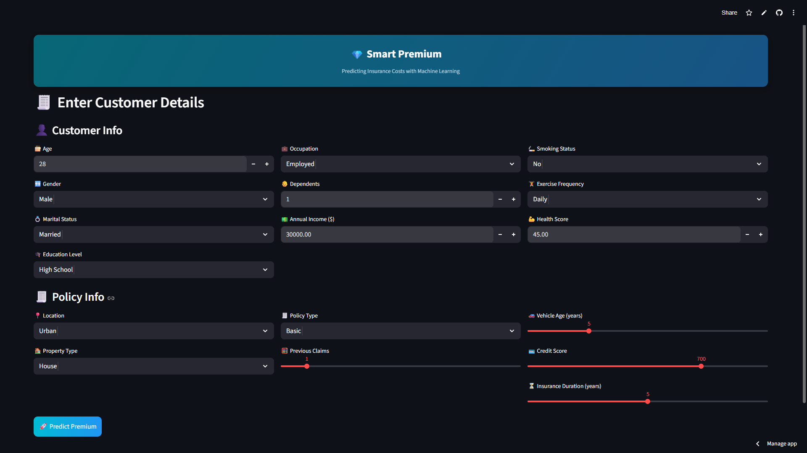
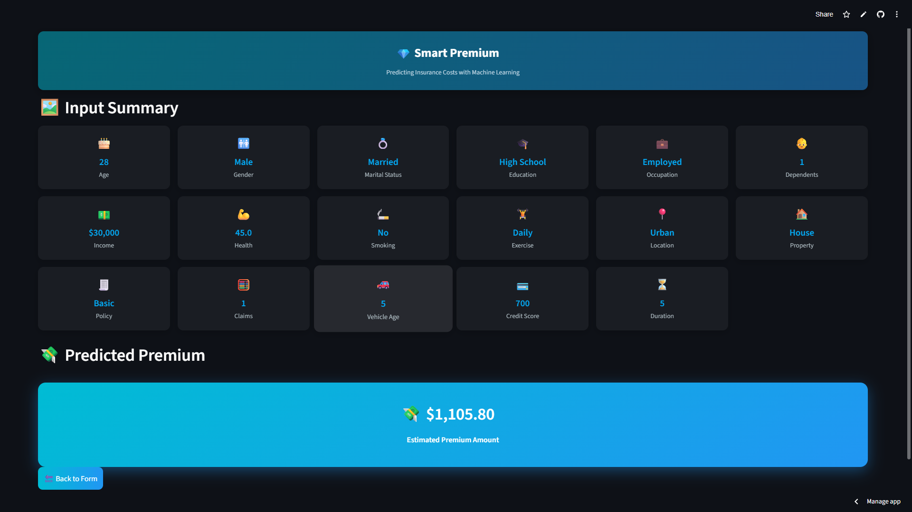

## 💎 SmartPremium: Predicting Insurance Costs with Machine Learning

## 🧩 Problem Statement

Insurance companies use factors such as age, income, health status, and claim history to estimate premiums for their customers.  
The goal of this project is to develop a machine learning model that predicts insurance premiums using customer and policy information, enabling **data-driven pricing, risk assessment, and real-time quote estimation**.

---

## 🎯 Project Objectives

- 📥 Load and explore the insurance dataset  
- 🧹 Perform data cleaning, normalization, and scaling  
- 📈 Develop regression models to predict insurance premiums  
- 🔄 Build a complete preprocessing + modeling pipeline  
- 🧪 Track experiments using **MLflow (with DagsHub)**  
- 📊 Validate model performance using a hold-out validation set  
- 🌐 Deploy the trained model as a **Streamlit web application**

---

## 🧰 Technologies Used

- 🐍 **Programming Language** : Python  
- 📊 **Data Processing** : Pandas, NumPy  
- 🧠 **Feature Engineering** : Box-Cox Transform, StandardScaler  
- 🤖 **Machine Learning** : Scikit-Learn, XGBoost  
- 🧪 **Experiment Tracking** : MLflow (DagsHub Tracking Server)  
- 🚀 **Model Deployment** : Streamlit Cloud  
- 🛠️ **Development Tools** : VS Code, Jupyter Notebook  

---

## 📁 Files & Notebooks

- 📓 `model_building.ipynb` – EDA, feature transformation, and model training  
- 🔁 `mlpipeline_mlflow.ipynb` – ML pipelines and MLflow experiment tracking  
- 🧪 `model_evaluate.ipynb` – Model inference on unseen test data  
- 📦 `preprocessing_pipeline.pkl` – Serialized preprocessing pipeline  
- 🏁 `smart_premium_model.pkl` – Final production-ready model  

---

## 📊 Dataset Overview

- 📄 **Format**: CSV  
- 📦 **Records**: 200,000  
- 🧾 **Features**: 20 customer, lifestyle, financial, and policy attributes  
- 🎯 **Target Variable**: Premium Amount  
- ⚠️ **Note**: Synthetic dataset created for educational purposes  

### 🔍 Dataset Characteristics

- ❓ Missing values  
- 🔢 Incorrect data types  
- 📉 Skewed numerical features  
- 🧬 Mixed data types:
  - Numerical  
  - Categorical  
  - Text  
  - Date  

### 🔗 Dataset URL

- 📎 [Google Drive Folder (Dataset)](https://drive.google.com/drive/folders/1GNSocgMntDHdTVmT2q0p1sE5iZss2h5_?usp=drive_link)

---

## 🛠️ Model Building Summary

All steps were performed in `model_building.ipynb`.

### ✔ Feature Selection & Cleaning 🧹

- Set the ID column as index  
- Dropped non-predictive features:
  - `"Customer Feedback"`
  - `"Policy Start Date"`

### ✔ Feature Transformation 🔄

- Applied Box-Cox transformation (λ = 0.5) to `"Annual Income"` to reduce skewness  

### ✔ Feature Scaling 📏

- Applied **StandardScaler** to all independent features  

### ✔ Model Training 🤖

- Trained multiple regression models:
  - Linear Regression  
  - Decision Tree Regressor  
  - Random Forest Regressor  
  - XGBoost Regressor  

- Evaluated using:
  - MAE  
  - RMSE  
  - R² Score  

> 📌 Observation:  
> Model performance reflects limited predictive signal in the features — a realistic scenario in insurance pricing problems.

---

## 🔁 ML Pipeline & MLflow (DagsHub)

Implemented in `mlpipeline_mlflow.ipynb`.

### ✔ Preprocessing Pipeline 🧠

- Built a Scikit-Learn pipeline automating:
  - Feature handling  
  - Box-Cox transformation  
  - Feature scaling  

- Saved as:
  - 📦 `preprocessing_pipeline.pkl`

### ✔ MLflow Tracking 🧪

- Connected MLflow to **DagsHub Tracking Server**  
- Logged:
  - Parameters  
  - Metrics  
  - Artifacts  
- Best-performing model registered and promoted to **Production**

🔗 MLflow Tracking URL:  
👉 https://dagshub.com/nithis127/Smart_Premium.mlflow  

### ✔ Model Export 📤

- Final model saved as:
  - 🏁 `smart_premium_model.pkl`

---

## 📈 Model Evaluation

- ✅ Model evaluated using a **hold-out validation split**  
- ❌ Test dataset does **not contain ground-truth labels**  
- 🔍 Test data used **only for inference and prediction generation**

---

## 🌐 Streamlit Deployment

- 🖥️ Built a Streamlit app for **real-time insurance premium prediction**  
- App loads:
  - `preprocessing_pipeline.pkl`
  - `smart_premium_model.pkl`  

🚀 Live App:  
👉 https://smartpremium-ibje7qsuzbkufzlkxfayub.streamlit.app/

---

## 🖼️ Streamlit Application Screenshots

---

## 🏁 Results

- ✅ End-to-end ML pipeline implemented  
- 🧪 Experiments tracked using MLflow and DagsHub  
- 🚀 Production-ready model deployed via Streamlit  

---

## 📐 Evaluation Metrics

- 📉 **MAE** – Mean Absolute Error  
- 📊 **RMSE** – Root Mean Squared Error  
- 📈 **R² Score** – Variance explained by the model  

---

## ✅ Conclusion

The **SmartPremium** project demonstrates a complete end-to-end machine learning workflow:

- 🧹 Data preprocessing and transformation  
- 📏 Feature scaling and skewness handling  
- 🤖 Regression model training and evaluation  
- 🧪 MLflow-based experiment tracking  
- 🌐 Deployment-ready prediction system using Streamlit  

This project highlights how **data quality and feature relevance** directly impact model performance in real-world insurance pricing scenarios.

---

⭐ If you found this project useful, feel free to star the repository!
